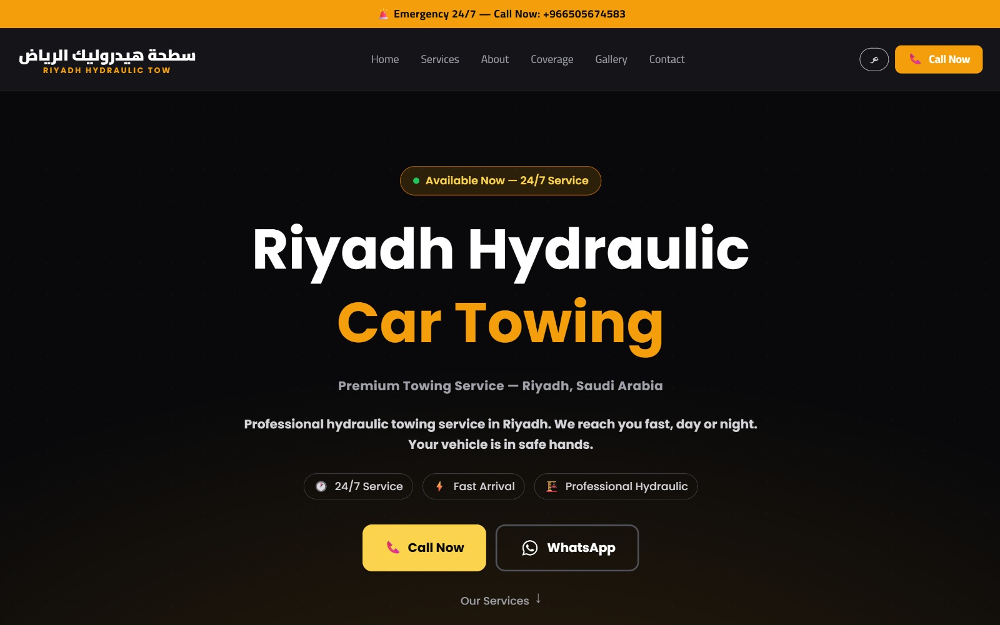
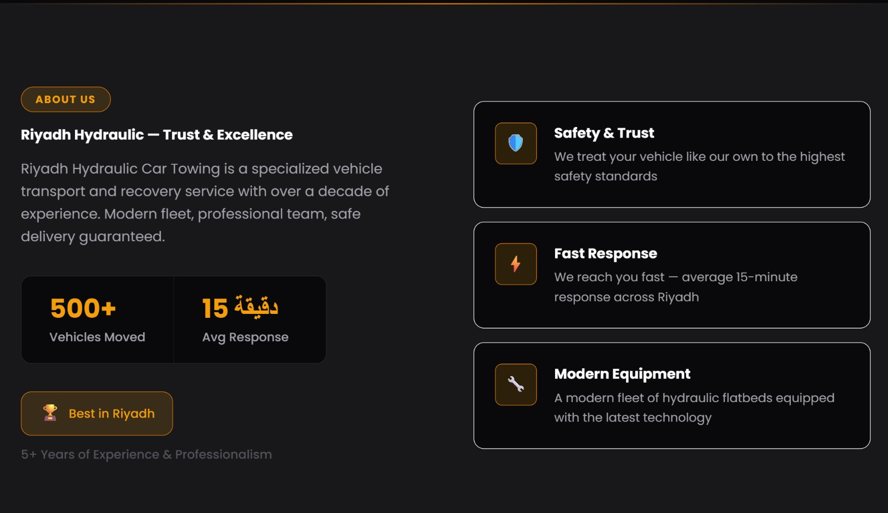
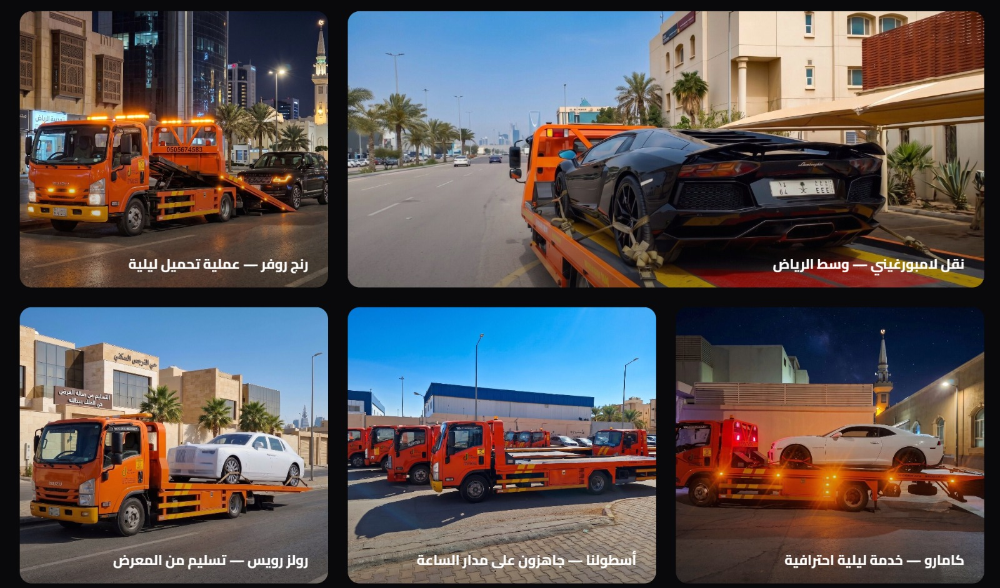
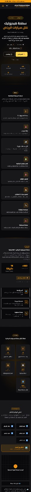
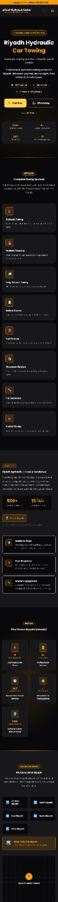

# سطحة هيدروليك الرياض — Riyadh Hydraulic Towing

> Production towing service website — bilingual Arabic/English SPA built with Angular 21 + Tailwind CSS v4.

🌐 **Live:** [riyadhsatha24.com](https://riyadhsatha24.com)

---

## Screenshots

### Desktop — Homepage


### Desktop — About Us


### Gallery Section


### Mobile — Arabic (RTL)


### Mobile — English (LTR)


---

## Stack

| | |
|---|---|
| Framework | Angular 21 — standalone components, signals |
| Styling | Tailwind CSS v4 + CSS variables |
| Language | TypeScript |
| Hosting | Vercel |

---

## Features

- Bilingual Arabic / English with full RTL support
- Mobile-first responsive design
- Single page — smooth scroll navigation
- Language switcher with localStorage persistence
- Floating WhatsApp + Call buttons
- Google Maps embed
- SEO meta tags + Open Graph
- Pre-rendered HTML — Google indexes full content

---

## Structure

```
src/app/
├── components/
│   ├── navbar
│   ├── hero
│   ├── services
│   ├── about
│   ├── why
│   ├── coverage
│   ├── gallery
│   ├── contact
│   ├── footer
│   └── floating-buttons
├── core/
│   └── services/
│       ├── language.service
│       └── scroll.service
├── interfaces/
├── data/
└── constants/
```

---

## Getting Started

```bash
npm install
ng serve
```

Open `http://localhost:4200`

---

## Build

```bash
ng build --configuration production
```

Output → `dist/riyadh-hydraulic-towing/browser`

---

## Deployment

Hosted on Vercel — push to `main` triggers automatic redeploy.

---

## Notes

- All colors use CSS variables from `styles.css` — no hardcoded values
- Translations live in `translation.data.ts` — no external i18n library
- Static data is fully typed — ready for Supabase migration
- Google Search Console verified and sitemap submitted